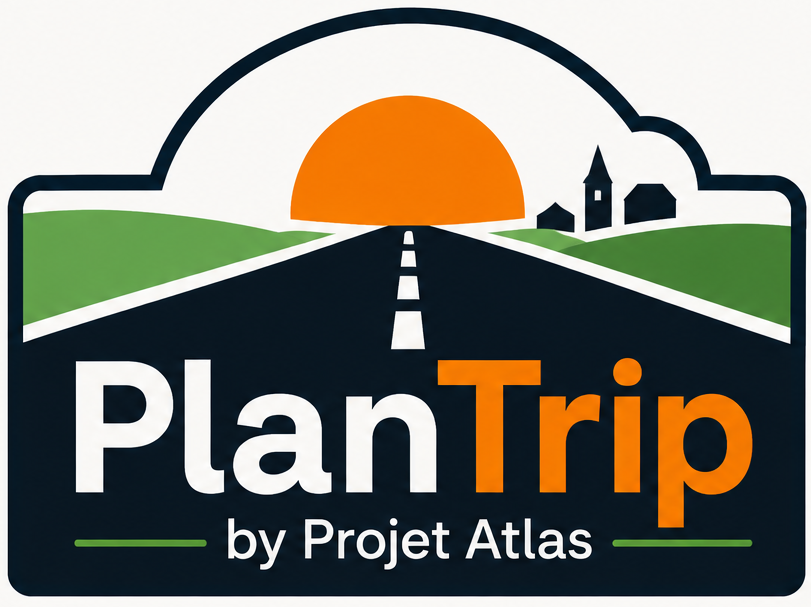

<p align="center">
  
</p>

<h1 align="center">PlanTrip</h1>

<p align="center">
  <strong>La route mène là où tu veux.</strong>
</p>

<p align="center">
  Une application Open Source de préparation de voyage développée dans le cadre de <strong>Projet Atlas</strong>.
</p>

<p align="center">

[Visual Identity](VISUAL_IDENTITY_GUIDELINES.md) •
[DevBook](DEVBOOK.md) •
[Roadmap](ROADMAP.md) •
[Licence](LICENSE)

</p>

---

## Préparer un voyage devrait déjà faire partie du voyage.

PlanTrip est né d'une idée simple : la préparation d'un voyage ne devrait jamais être une corvée.

Aujourd'hui, organiser un itinéraire signifie souvent jongler entre une multitude d'applications, de cartes, de notes, de réservations, de budgets et de documents. Plus le projet devient ambitieux, plus cette organisation devient complexe.

PlanTrip rassemble tout cela dans un environnement unique, pensé pour accompagner le voyageur avant, pendant et après son départ.

Notre objectif n'est pas seulement de planifier un itinéraire.

Notre objectif est de rendre la préparation aussi agréable que le voyage lui-même.

## Pourquoi PlanTrip ?

Parce qu'un bon logiciel disparaît derrière l'expérience qu'il rend possible.

PlanTrip ne cherche pas à impressionner par la quantité de ses fonctionnalités, mais par leur cohérence.

Chaque écran, chaque interaction et chaque décision de conception poursuivent le même objectif :

- réduire la charge mentale ;
- rendre les informations immédiatement compréhensibles ;
- permettre de prendre de meilleures décisions ;
- laisser le voyage reprendre sa place au centre de l'expérience.

Nous pensons que la simplicité n'est pas une absence de fonctionnalités.

C'est le résultat d'un travail de conception exigeant.

## Les principes qui guident le projet

PlanTrip est construit autour de quelques convictions simples.

- **Le voyage commence bien avant le départ.**
- **Une bonne interface est une interface qu'on oublie.**
- **Chaque élément doit avoir une raison d'exister.**
- **La documentation fait partie intégrante du produit.**
- **L'Open Source mérite la même qualité de conception qu'un logiciel commercial.**
- **L'utilisateur ne devrait jamais avoir à deviner.**

Ces principes influencent autant le développement de l'application que la manière dont nous écrivons notre documentation ou organisons notre dépôt GitHub.

## Aperçu

PlanTrip est actuellement en cours de développement.

Les captures d'écran ci-dessous illustrent la direction artistique et l'expérience utilisateur visées par le projet.

> *(Les visuels seront progressivement remplacés par des captures réelles au fil du développement.)*

<p align="center">
    
</p>

<p align="center">
    <em>La préparation d'un voyage doit être simple, agréable et intuitive.</em>
</p>

## Fonctionnalités

PlanTrip rassemble dans une seule application tous les outils nécessaires à la préparation d'un voyage.

### Planification

- Création d'itinéraires
- Gestion des étapes
- Calendrier de voyage
- Organisation des journées

### Budget

- Estimation des dépenses
- Suivi du budget
- Répartition par catégories
- Vision globale des coûts

### Documents

- Réservations
- Billets
- Passeports
- Assurances
- Documents administratifs

### Lieux

- Hébergements
- Restaurants
- Points d'intérêt
- Aires de repos
- Stations-service
- Adresses personnelles

### Organisation

- Checklists
- Notes
- Rappels
- Tâches avant le départ

### Et bien plus...

PlanTrip évolue en permanence.

De nouvelles fonctionnalités viendront enrichir progressivement l'application sans jamais remettre en cause son objectif principal : rester simple.

## Architecture

Le projet est développé autour d'une architecture moderne, modulaire et entièrement Open Source.

Chaque composant est conçu pour être :

- lisible ;
- maintenable ;
- documenté ;
- évolutif.

Nous privilégions des choix techniques simples, robustes et compréhensibles plutôt que des solutions complexes difficiles à maintenir.

Cette philosophie s'applique autant au code qu'à l'organisation du dépôt GitHub.

## Documentation

Nous considérons la documentation comme une partie intégrante du projet.

Elle ne vient pas expliquer le logiciel une fois terminé.

Elle accompagne sa conception, documente les décisions importantes et facilite l'arrivée de nouveaux contributeurs.

| Document | Description |
|-----------|-------------|
| `README.md` | Présentation générale du projet |
| `VISUAL_IDENTITY_GUIDELINES.md` | Identité visuelle officielle |
| `DEVBOOK.md` | Vision technique et architecture |
| `ROADMAP.md` | Évolutions prévues |
| `LICENSE` | Licence Open Source |

## Installation

Le projet est actuellement en cours de développement.

Les instructions d'installation évolueront au rythme de l'application.

```bash
git clone https://github.com/nanou974/PlanTrip.git

cd PlanTrip
```

Les guides d'installation détaillés seront publiés prochainement dans la documentation du projet.

## Contribuer

PlanTrip est un projet Open Source.

Toutes les contributions sont les bienvenues :

- Développement
- Documentation
- Traductions
- Design
- Tests
- Signalement de bugs
- Suggestions

Avant toute contribution importante, nous vous invitons à ouvrir une Discussion ou une Issue afin d'échanger avec la communauté.

Notre objectif n'est pas seulement de construire une application.

Nous voulons construire un projet agréable auquel chacun prendra plaisir à contribuer.

## Roadmap

Le développement de PlanTrip suit une feuille de route progressive.

Les prochaines étapes incluent notamment :

- Construction de l'interface utilisateur
- Gestion complète des itinéraires
- Organisation des étapes
- Gestion documentaire
- Budget de voyage
- Synchronisation des données
- Expérience mobile

Consultez **ROADMAP.md** pour suivre l'évolution du projet.

## Projet Atlas

PlanTrip est le premier projet de **Projet Atlas**.

Projet Atlas rassemble des applications Open Source conçues autour d'une même philosophie : créer des outils utiles, durables et agréables à utiliser.

Chaque projet partage les mêmes principes :

- une architecture claire ;
- une documentation soignée ;
- une identité visuelle cohérente ;
- un développement ouvert et transparent.

Plus qu'une collection d'applications, Projet Atlas est un écosystème pensé pour évoluer dans le temps, avec une attention constante portée à la qualité, à la simplicité et au respect des utilisateurs.

## Licence

Ce projet est distribué sous licence **MIT**.

Consultez le fichier **LICENSE** pour plus d'informations.

<p align="center">

**La route mène là où tu veux.**

Développé avec soin dans le cadre de **Projet Atlas**.

</p>
