# PlanTrip
### Une publication de Projet Atlas

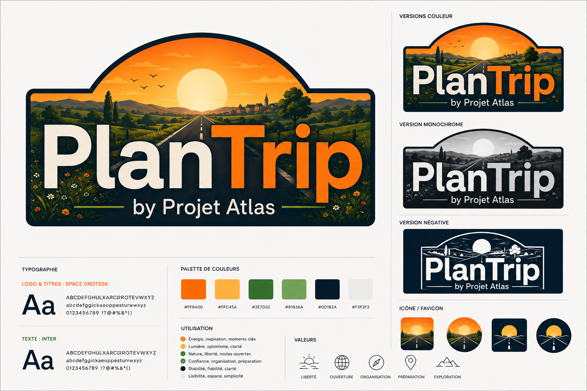

Certaines choses se préparent.
D'autres se vivent.

Celle-ci fait les deux.

---

# Brand Board

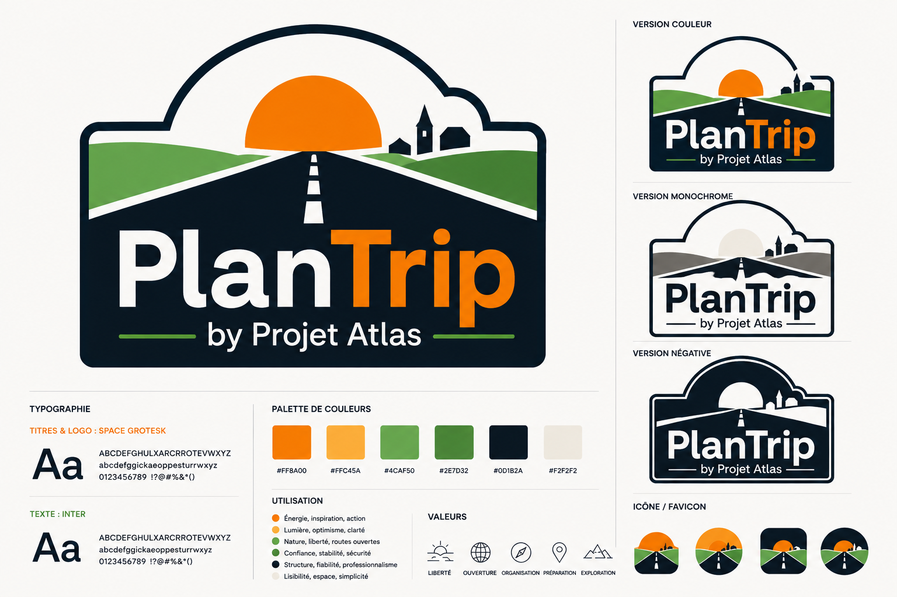

La préparation est souvent traitée comme une taxe à payer avant que la récompense ne commence — quelque chose à traverser pour que le vrai voyage puisse démarrer. PlanTrip la traite comme le premier chapitre de la récompense, pas comme son péage.

Le projet n'a pas été construit autour d'un type de véhicule, d'un type d'itinéraire, ou d'un type de voyage. Il a été construit autour d'un type de voyageur : quelqu'un qui compose avec de vraies limites — d'argent, de temps, de marge d'erreur — pour qui une mauvaise décision coûte plus qu'un après-midi.

La liberté ne signifie pas l'absence de règles. Elle signifie une clarté suffisante sur les règles pour cesser d'y penser. La simplicité n'est pas un style visuel, c'est une promesse que rien d'important ne reste caché derrière un menu. Le calme est une décision prise au nom de quelqu'un qui est déjà fatigué avant même d'être parti. La confiance se gagne en ne demandant jamais à quelqu'un de deviner. La découverte ne survit que si la préparation qui l'entoure ne l'écrase pas d'abord.

Tout, chez PlanTrip, découle de cela. Pas une liste de fonctionnalités. Une posture. Une manière de se tenir aux côtés de quelqu'un plutôt qu'au-dessus.

Quelque part en chemin, il a fallu choisir entre une marque qui paraissait correcte et une marque qui paraissait vécue. La direction la plus sage était sur la table, et elle a été écartée délibérément. Rien ici n'avait besoin d'être minimal pour être honnête.

---

# Logo System

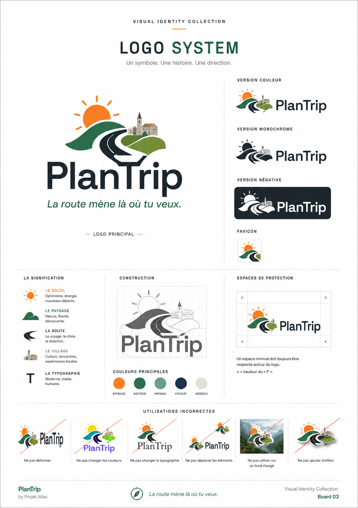

Chaque jour se termine de la même façon, et il n'a jamais deux fois le même visage. C'est de cette contradiction que naît le symbole.

Le haut du symbole suit une ligne d'horizon — pas une ligne droite, mais une ligne qui se soulève, doucement, dans la courbe d'un soleil déjà à moitié disparu. C'est la partie de la journée que personne ne planifie et que tout le monde retient : les dix minutes où la lumière change et où un lieu traversé depuis des heures se met soudain à ressembler à un endroit où l'on voudrait revenir.

Sous cette douceur, rien ne bouge. La base garde sa ligne, carrée et sans excuse, refusant toute tentation de s'arrondir pour répondre au ciel au-dessus d'elle. Le soleil peut se coucher comme il l'entend. Le sol, lui, reste où il est. Cette tension — un horizon autorisé à se courber, une fondation qui ne l'est pas — résume l'idée tout entière en une seule forme.

Le lettrage suit la base, pas le ciel. Droit, de niveau, sans fioriture. Un symbole a le droit à un instant de poésie. Un nom, lui, doit rester lisible à distance, à moitié couvert de poussière, aperçu en passant — alors il se tient droit et laisse l'horizon rêver à sa place.

La simplicité, ici, n'est pas un choix esthétique. C'est une promesse tenue à vue. Une marque aussi discrète mérite sa place sur un écran, un autocollant, une couverture de passeport, sans jamais rivaliser d'attention avec la vie qui se déroule autour d'elle.

---

# Color Language

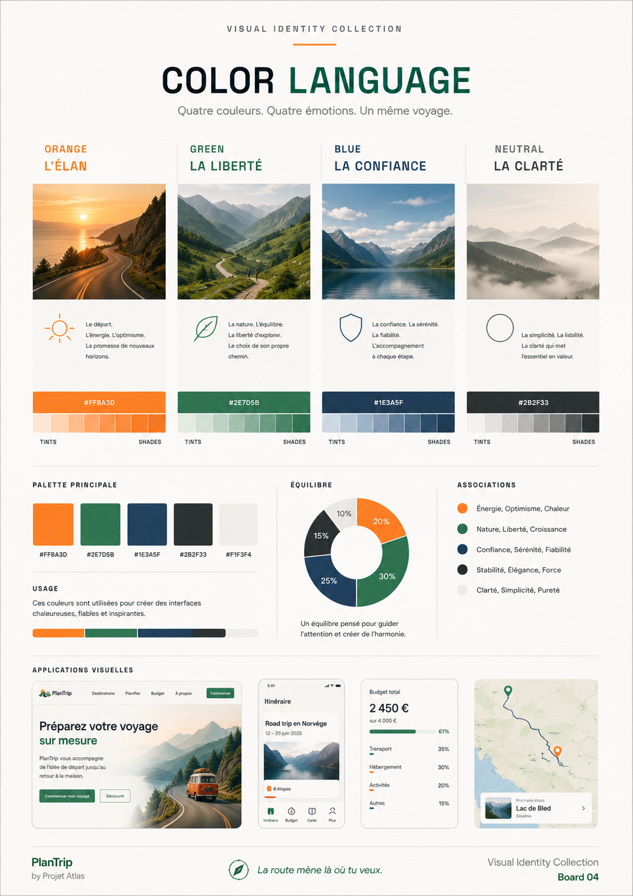

Certaines couleurs appartiennent à certaines heures. Il existe un orange particulier qui n'existe que dans les vingt dernières minutes avant le crépuscule, quand la lumière cesse d'être blanche et devient généreuse. PlanTrip a emprunté cette heure et l'a gardée.

À côté d'elle se trouve un vert qui ne doit rien aux cartes postales — plus proche de la couleur que prend un paysage une fois que le soleil est descendu assez bas pour cesser de tout décolorer. Pas le vert d'une forêt de brochure, mais celui de la dernière heure avant que les phares ne deviennent nécessaires, quand le monde ressemble brièvement plus à lui-même qu'à midi.

Ces deux couleurs n'ont jamais été faites pour rester immobiles. Ensemble, elles portent quatre humeurs distinctes plutôt qu'une seule humeur aplatie : l'orange porte l'anticipation et l'arrivée, les deux extrémités d'un voyage qui se ressemblent presque de l'intérieur ; le vert porte le calme et la confiance tranquille, le long milieu sans éclat où rien ne va de travers et où personne ne remarque rien. Une palette qui ne saurait qu'être chaude s'épuiserait dès la deuxième étape. Une palette construite pour tenir quatre registres peut porter le voyage tout entier, pas seulement ses meilleurs moments.

Aucune de ces couleurs ne cherche à séduire vers un lieu jamais visité. Elles cherchent à rappeler un lieu dont on connaît déjà la sensation — le soulagement particulier de l'arrivée, l'anticipation particulière du départ. Une palette construite à partir de la mémoire plutôt que du fantasme demande moins à l'imagination et lui rend davantage.

---

# Typography

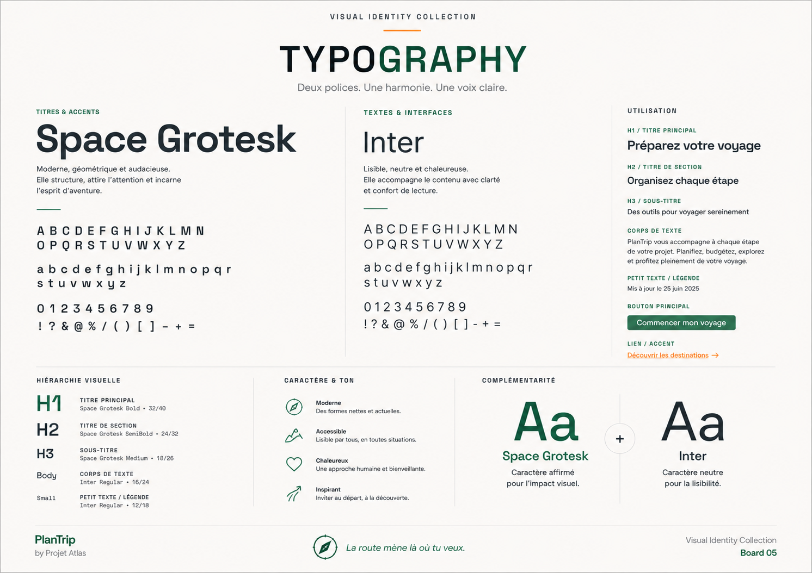

Le meilleur copilote parle peu et inspire une confiance totale.

Les typographies de PlanTrip ont été choisies dans cet esprit — l'une pour les moments qui ont besoin d'élever la voix, l'autre pour tout le reste. Ensemble, elles forment moins un système typographique qu'un ton : clair, sans hâte, jamais plus fort que l'information qu'il porte.

Un voyageur qui vérifie si une décision est sûre à prendre n'a pas envie de personnalité. Il a envie d'une réponse, formulée si clairement que la question se dissout au moment même où elle est lue. Une typographie qui attire l'attention sur elle-même, à cet instant précis, est une typographie qui a manqué son unique mission.

La cohérence fait quelque chose de plus discret que la lisibilité. Une lettre qui se comporte de la même façon à minuit qu'à l'aube devient, avec le temps, quelque chose de plus proche d'une voix que d'une police — reconnaissable non pas parce qu'on l'a remarquée, mais parce qu'on n'a jamais eu à le faire.

C'est toute l'ambition ici. Pas une typographie dont on se souvient. Une typographie qu'on n'a jamais eu de raison de remettre en question.

---

# Homepage

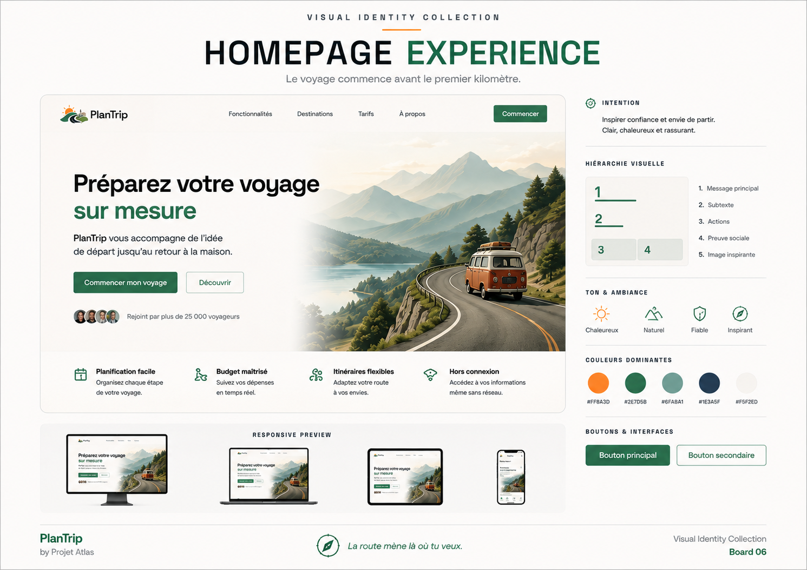

Les dix premières secondes décident de quelque chose qu'aucune ingénierie, aussi bonne soit-elle, ne peut défaire après coup.

Une page d'accueil n'est pas un résumé de fonctionnalités. C'est une respiration retenue — l'instant entre la curiosité d'un inconnu et sa décision de rester ou de partir. L'écran d'ouverture de PlanTrip a été pensé pour cette respiration précise, pas pour la version du visiteur qui comprend déjà ce que fait le produit.

Il n'y a aucune tentative de prouver une capacité dès ce premier regard. La preuve viendra plus tard, gagnée par l'usage. Ce que la page d'accueil offre à la place, c'est une permission — celle d'imaginer, un instant, une version du voyage qui semblait hors de portée parce que sa préparation semblait hors de portée. Un champ de possibles ouvert, resserré avec douceur, plutôt qu'un mur d'options présentées d'un coup.

La curiosité, bien traitée, n'a pas besoin d'être convaincue. Elle a besoin d'une porte entrouverte, et d'assez de calme autour d'elle pour que la franchir ressemble à une idée du visiteur lui-même.

---

# Dashboard

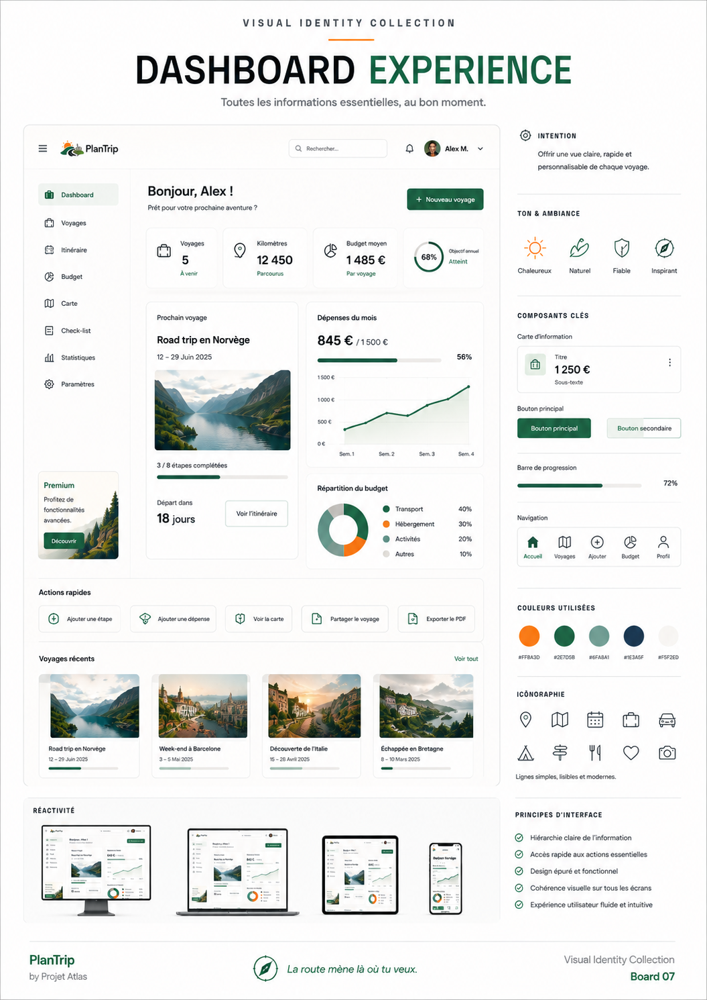

Entre le rêve d'un voyage et sa réalité se trouve une bonne dose d'arithmétique sans éclat — des dates, des budgets, des décisions encore en suspens. Livrée à elle-même, cette arithmétique est l'endroit précis où l'enthousiasme s'éteint en silence.

Le tableau de bord existe pour porter ce poids afin que le voyageur n'ait pas à le garder en tête. Son rôle n'est pas d'afficher tout ce qui pourrait être su. Son rôle est d'afficher exactement ce qu'il faut décider ensuite, et de laisser le reste s'effacer jusqu'à ce qu'il soit nécessaire.

Il existe un soulagement particulier à ouvrir un écran et comprendre immédiatement sa propre situation — ce qui est réservé, ce qui est en attente, ce qui nécessite encore une décision avant vendredi. Ce soulagement n'est pas un effet visuel. C'est le fruit d'une retenue, choisie avec soin, écran après écran, en faveur de la tranquillité d'esprit du voyageur plutôt que du désir du concepteur de montrer tout ce que le système sait faire.

L'argent mérite la même retenue que tout le reste ici. Un budget qui ne se révèle qu'à la fin d'un voyage n'est pas un budget, c'est une surprise — alors les chiffres restent visibles, tôt et souvent, jamais plus bruyants qu'ils ne doivent l'être, jamais dissimulés jusqu'à ce qu'il soit trop tard pour corriger le tir. Il en va de même pour les papiers que réclame un voyage : rassemblés, classés, et oubliés jusqu'au moment précis où ils redeviennent nécessaires.

La veille du départ a son propre tableau de bord, dans l'esprit sinon dans le nom : tout est vérifié, tout est pris en compte, rien ne reste à découvrir au petit matin. La confiance, dans ce contexte, a l'air presque ennuyeuse. C'est voulu. Ennuyeux, ici, veut dire fiable.

---

# Mobile

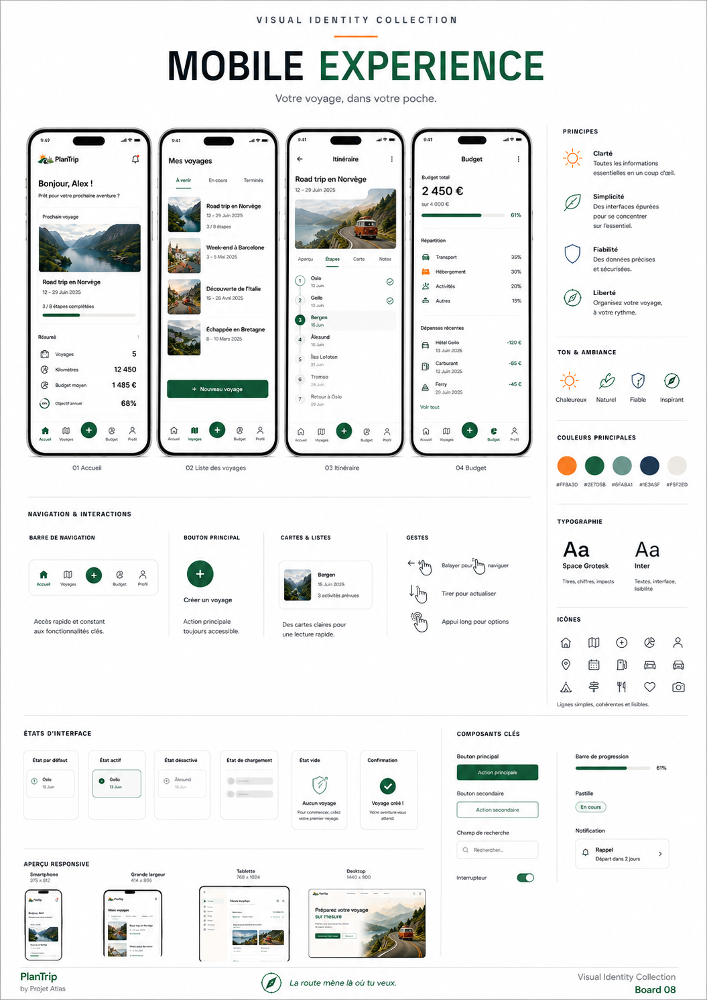

Un téléphone consulté en mouvement, d'une seule main, l'attention déjà à moitié ailleurs, est un instrument très différent du même téléphone posé sur un bureau à la maison. Il se consulte par éclats, pas par sessions — un coup d'œil pour une réponse, pas une navigation pour s'inspirer.

L'expérience mobile de PlanTrip a été façonnée par cette posture plutôt que réduite depuis une version de bureau. Des pouces, pas des curseurs. Des coups d'œil, pas des sessions. Une réponse unique et claire à une question urgente et unique, livrée avant que l'instant du besoin ne soit passé.

Rien, dans la mobilité, n'est présenté comme du marketing d'aventure. Tout est présenté comme de la logistique, traitée avec assez de grâce pour cesser de ressembler à de la logistique.

---

# Planner

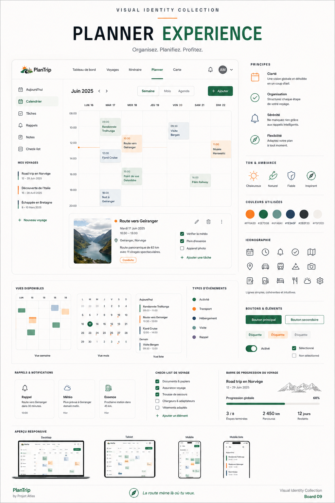

Avant qu'une roue ne tourne, un voyage existe déjà — comme une forme encore floue dans les soirées de quelqu'un, assemblée au fil de plusieurs sessions autour d'une table de cuisine, révisée à mesure que de nouvelles contraintes apparaissent et que d'anciennes se résolvent.

Le planificateur est l'endroit où cette forme prend structure sans perdre sa souplesse. Il résiste à l'envie d'exiger une certitude trop tôt. Une étape peut rester vague pendant des semaines avant d'avoir besoin d'une date. Un itinéraire peut contenir trois versions possibles de lui-même avant de se resserrer en une seule. L'outil suit le rythme de décision du voyageur plutôt que de lui imposer le sien.

Ce qui se construit ici, sous l'interface, ce sont de premiers souvenirs — l'anticipation elle-même devenant une partie de l'expérience plutôt qu'une corvée qui la précède. Bien avant le premier matin du voyage réel, quelque chose a déjà commencé. Le rôle discret du planificateur est de protéger ce commencement, pas de se précipiter vers le départ.

---

# GitHub

Un projet open source fait une promesse particulière dès qu'il publie sa première ligne de code : que n'importe qui, à n'importe quelle heure, dans n'importe quel pays, puisse ouvrir le dépôt et comprendre ce qu'il a sous les yeux sans avoir à demander la permission.

Cette promesse se joue dans la documentation, c'est pourquoi la documentation est traitée ici comme une part de l'identité plutôt que comme un à-côté. Un README qui se lit comme un haussement d'épaules sape chaque décision soignée prise ailleurs dans le produit. Un README écrit avec attention signale, immédiatement, que le même soin s'étend au code qui se trouve derrière lui — et aux personnes qui pourraient y contribuer ensuite.

Une architecture expliquée clairement est une forme d'hospitalité. Elle indique à un inconnu, avant même son premier commit, que son temps sera respecté ici. La communauté n'apparaît pas parce qu'un projet est public. Elle apparaît parce qu'un projet s'est rendu lisible à des personnes qui n'étaient pas là quand il a été construit.

Une documentation soignée n'est pas un supplément d'âme ajouté à l'open source. Pour un projet comme celui-ci, c'est l'un des endroits où la philosophie est le plus clairement mise à l'épreuve.

L'écosystème ne s'arrête pas à un seul dépôt. PlanTripSave, né du même raisonnement et élevé à ses côtés, porte cette ressemblance familiale jusque dans son propre code plutôt que de repartir de zéro. Un visiteur qui fait déjà confiance à l'un devrait reconnaître l'autre en quelques secondes — même soin, même retenue, même refus de laisser un inconnu deviner.

---

# Iconography

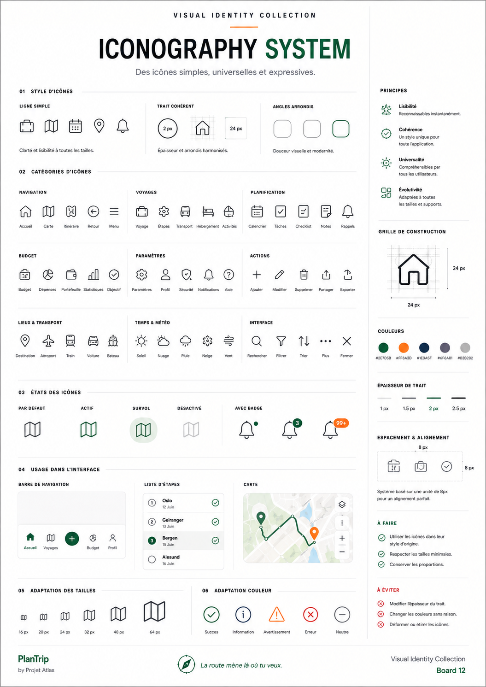

Une icône bien dessinée se comprend avant d'être lue. Cette demi-seconde de reconnaissance pré-verbale est tout l'enjeu — un raccourci que l'œil emprunte pour éviter à l'esprit de s'arrêter.

Le jeu d'icônes de PlanTrip a été construit autour de ce raccourci plutôt qu'autour de l'ingéniosité. Une icône qui exige une légende pour être comprise a déjà trahi le voyageur qu'elle était censée servir — souvent au moment précis, en pleine décision, où il a le moins de patience pour la déchiffrer.

Ce qui tient un ensemble d'icônes ensemble n'est pas tant une charte graphique partagée qu'une retenue partagée : la même discipline appliquée symbole après symbole, si bien que la familiarité avec l'une ouvre la familiarité avec la suivante. Un langage silencieux, pour mériter ce nom, doit se comporter de façon constante même quand personne ne regarde d'assez près pour le remarquer.

---

# Visual Language

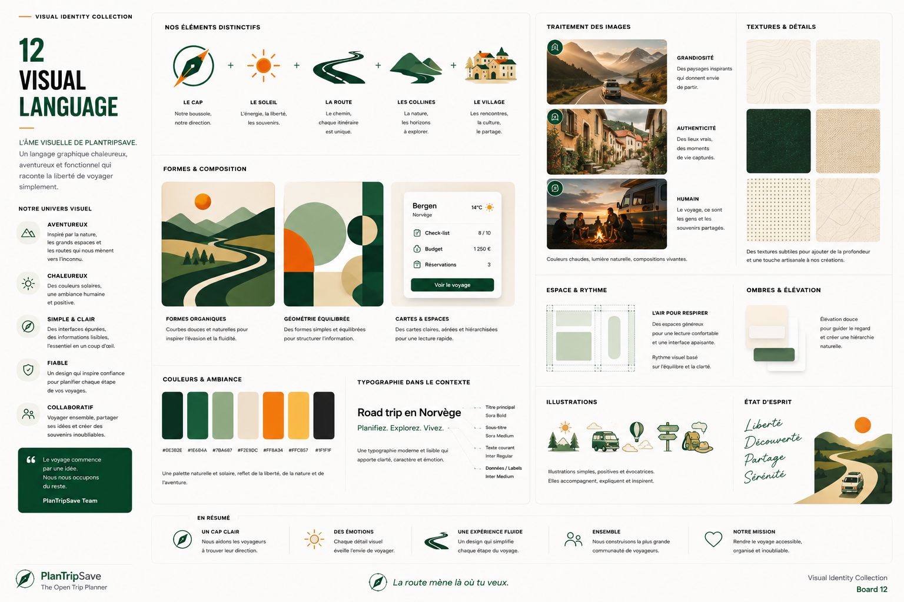

Chaque image que PlanTrip choisit de montrer est aussi, discrètement, une décision sur ce qu'il ne faut pas montrer. L'espace vide dans une photographie n'est pas vide par accident. Il est laissé là volontairement, pour que l'œil ait où se reposer, et pour que l'imagination ait où travailler.

Il existe une tentation, dans l'imagerie de voyage, à remplir chaque cadre de preuves — preuve de beauté, preuve d'aventure, preuve que cette destination valait mieux qu'une autre. La photographie de PlanTrip résiste à cette tentation. Une seule silhouette au bord d'un cadre large en dit davantage sur l'échelle, et sur l'accueil, qu'un cadre saturé de spectacle ne le pourrait jamais.

La composition privilégie ici les instants intermédiaires plutôt que les instants de carte postale : une main sur un volant, une carte pliée contre un tableau de bord, la lumière particulière d'une aire de repos à sept heures du matin. Ce ne sont pas les images qu'une destination choisirait pour se vanter. Ce sont les images dont une personne se souvient réellement.

La cohérence de ce langage visuel ne consiste pas à répéter un filtre. Elle consiste à maintenir la même température émotionnelle d'une image à l'autre — calme, sans hâte, légèrement feutrée — pour qu'aucune photographie ne paraisse jamais plus forte que celles qui l'entourent.

---

# Merchandise

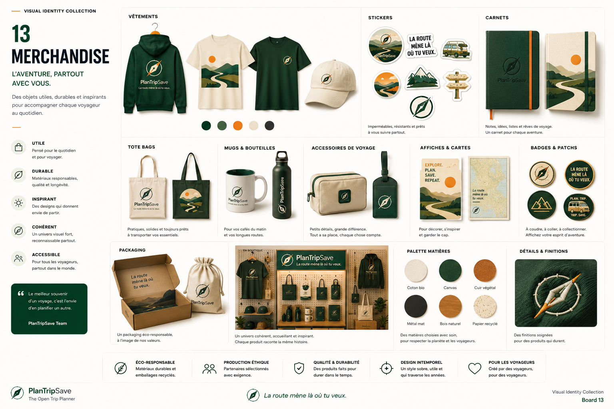

Une marque qui ne vit que sur des écrans fait un aveu discret : celui de ne pas s'attendre à être prise au sérieux ailleurs.

L'identité de PlanTrip a été conçue pour survivre au contact du monde physique — un autocollant sur un étui, un patch sur un sac en toile, une tasse qui survit à trois téléphones successifs. Pas du merchandising au sens promotionnel, mais la preuve que ce projet n'a jamais été seulement un logiciel. Il a toujours été destiné à voyager dans une poche, un sac, un porte-clés usé par un usage réel.

Les objets transportés ainsi accumulent un sens qu'un écran ne peut pas retenir. Un autocollant survit au voyage qui l'a mérité et annonce discrètement le suivant. Ce genre de permanence ne se fabrique pas par un bon design de produits dérivés. Elle se gagne, lentement, par une marque que quelqu'un a été réellement heureux de garder.

Les objets de PlanTripSave portent cette même lumière basse dont la marque est née — la même heure du jour qui apparaît sur un sac en toile ou une couverture de carnet que sur un écran. Une famille de produits qui semblent tous avoir été photographiés à la même heure dorée finit par former un seul et même ensemble, même dispersée entre une dizaine de sacs et d'étagères.

---

# Manifesto

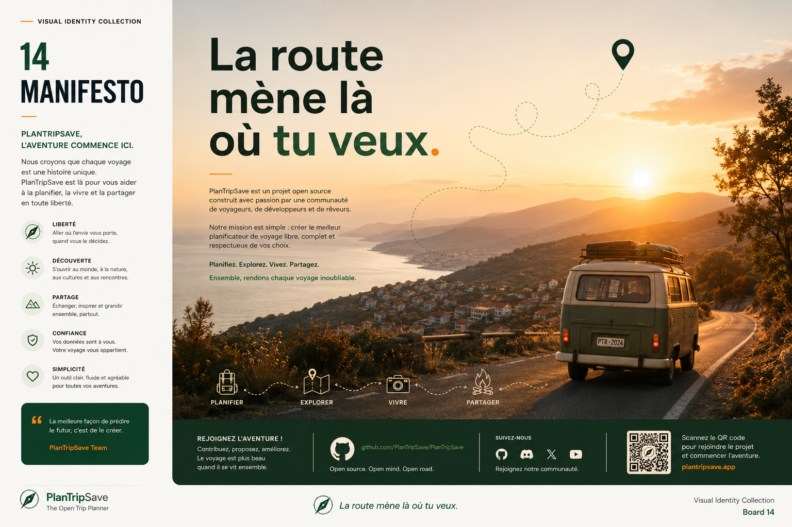

Tous les voyageurs n'ont pas le luxe d'un budget flexible, d'un calendrier ouvert, ou d'un plan sans faux pas.

La plupart ont un chiffre en tête qu'ils ne peuvent pas dépasser. Une semaine, pas un mois. Une marge d'erreur proche de zéro. Et malgré tout, quelque part, l'envie de partir.

PlanTrip a été construit pour eux en premier.

Non pas parce qu'ils comptent plus que les autres, mais parce qu'on leur a toujours demandé de préparer le plus difficile, avec le moins d'aide, et de leur dire le moins possible sur ce qui les attendait.

Un horizon ne se soucie pas de ce qu'on peut se permettre. Il indique simplement où la journée se termine, et laisse chacun décider, honnêtement, de ce qui est possible avant qu'elle ne se termine.

C'est tout ce que ceci a jamais eu pour but de faire.

Quelque part, ce soir, quelqu'un prépare un voyage dont il n'était pas certain d'avoir les moyens, se demandant si c'est vraiment quelque chose qu'il peut faire.

Oui.

Partez.
